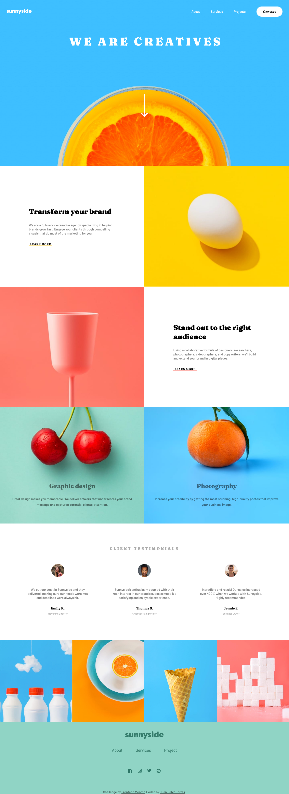

# Frontend Mentor - Sunnyside agency landing page solution

This is a solution to the [Sunnyside agency landing page challenge on Frontend Mentor](https://www.frontendmentor.io/challenges/sunnyside-agency-landing-page-7yVs3B6ef). Frontend Mentor challenges help you improve your coding skills by building realistic projects.

## Table of contents

- [Overview](#overview)
  - [The challenge](#the-challenge)
  - [Screenshot](#screenshot)
  - [Links](#links)
- [My process](#my-process)
  - [Built with](#built-with)
  - [What I learned](#what-i-learned)
  - [Continued development](#continued-development)
  - [Useful resources](#useful-resources)
- [Author](#author)


## Overview

This challenge was coded from scratch as a portfolio project using HTML, CSS and JavaScript.

### The challenge

Users should be able to:

- View the optimal layout for the site depending on their device's screen size
- See hover states for all interactive elements on the page

### Screenshot



### Links

- Solution URL: https://github.com/JayP-TA/sunnyside
- Live Site URL: https://jayp-ta.github.io/sunnyside/

### Built with

- Semantic HTML5 markup
- CSS custom properties
- Flexbox
- CSS Grid
- Javascript
### What I learned

This is the first personal project for my portfolio, it has helped me feel more confident in my abilities to make good loking, responsive, functional and accesible websites from scratch.
Below is a code snippet of the CSS I used to do the underline for the "Learn More" anchors.
```css
.grid-item-1 a {
  font-family: Fraunces;
  font-weight: 700;
  font-size: 13px;
  color: black;
  text-decoration: none;
  text-transform: uppercase;
  letter-spacing: 1px;
  text-align: left;
  background-position: bottom center;
  background-clip: padding-box;
  padding: 0 0.5em 0;
  background-size: 200px 5px;
  background-repeat: no-repeat;
  transition: all .3s;
}

.grid-item-1 a:hover, .grid-item-1 a:active, .grid-item-1 a:focus{
  background-size: 200px 17px;
} 
```
### Continued development

In the future I will be revisiting this project to add more detail and refactor any code that isn't very maintainable.

### Useful resources

- [Kevin Powell on YouTube](https://www.youtube.com/kepowob) - Excelent guides, explanations and general content from the CSS guru himself.
- [CodeCademy](https://www.codecademy.com/learn/paths/front-end-engineer-career-path) - An excelent platform to learn the basics of Front End Development with amazing presentation and guidance.

**Note: Delete this note and replace the list above with resources that helped you during the challenge. These could come in handy for anyone viewing your solution or for yourself when you look back on this project in the future.**

## Author

- Website - [Juan Pablo Torres](https://github.com/JayP-TA)
- Frontend Mentor - [@yourusername](https://www.frontendmentor.io/profile/JayP-TA)
- Twitter - [@yourusername](https://www.twitter.com/PabloSnl)

